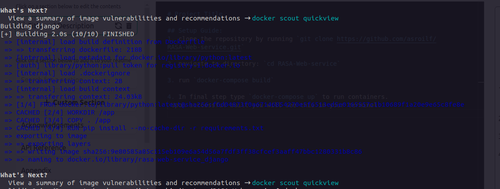
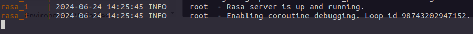
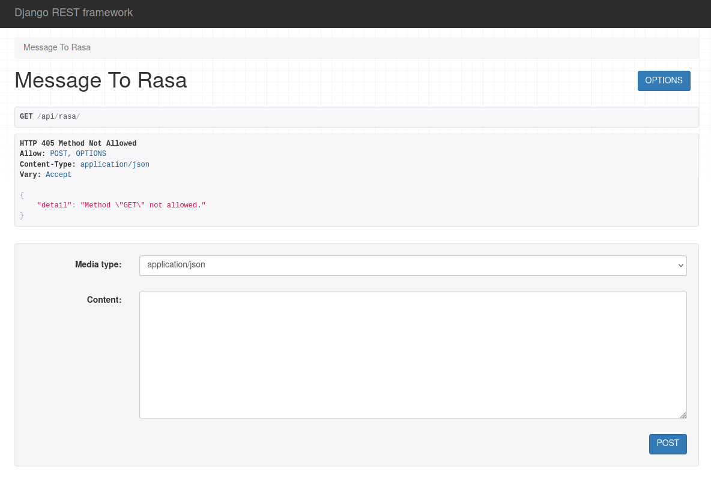
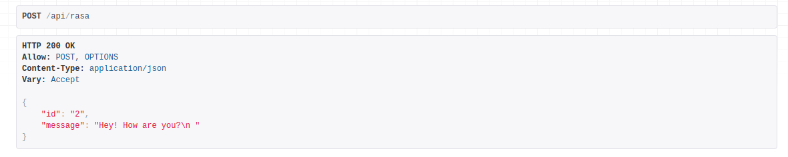
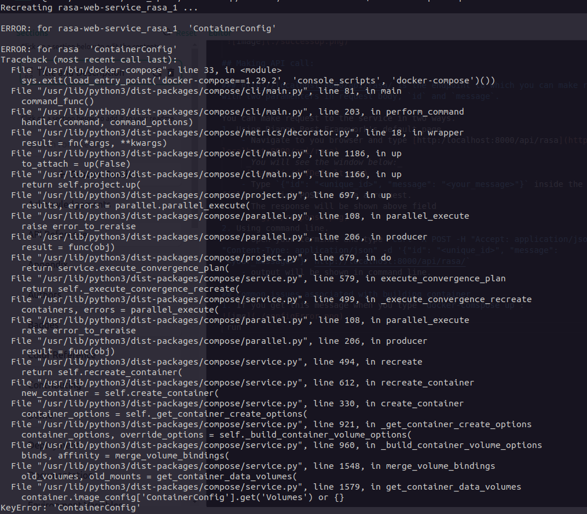

# Implementing Rasa Model Training and Web Service in Docker

## Setup Guide:
1. clone the repository by running `git clone https://github.com/asroilf/RASA-Web-service.git`

2. navigate to directory: `cd RASA-Web-service`

3. run `docker-compose build`
 Upon successful built you will see this in your terminal:

4. In final step type `docker-compose up` to run containers.
 If everything works well you will see this message at the bottom:
 

## Making API call:

### http://localhost:8000/api/rasa/ is the endpoint to which you can make request with two paramenters in request body, `id` and `message`.

You can make request to the service in two ways. 
1. Using Django Rest Framework's default page.
    - Navigate to you browser and type [http:/localhost:8000/api/rasa](http:/localhost:8000/api/rasa)
     _You will see the window below:_
    
    - Type `{"id": "<unique_id>", "message": "<your_message>"}` inside the text field and click POST to make a request.
    - The response will be shown above field
    
2. Using command line.
    - open your terminal and type `curl -X POST -H "Accept: application/json" -H "Content-Type: application/json" -d '{"id": "<unique_id>", "message": "<your_message>"}' http://localhost:8000/api/rasa/` 
    - output will be shown in command line.

## Common issues associated with building container
1. If you get this message when you type `docker-comspose up`:

 run `docker-compose down -v` to delete all previously running containers then run `docker-compose up` again.
